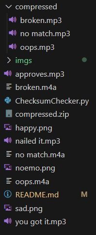

# Checksum File Verifier
**Checksum File Verifier** is a Python-based GUI tool that lets users verify file checksums with emotional feedback and sounds! Whether the file matches or not, **Checksum File Verifier** responds with an animated face and playful sound effects to bring your file verification process to life.

#### Features 
**1. Supports Multiple Hash Algorithms:** `blake2b`, `blake2s`, `md5`, `sha1`, `sha224`, `sha256`, `sha384`, `sha3_224`, `sha3_256`, `sha3_384`, `sha3_512`, `sha512`, `shake_128`, `shake_256`
**2. File Selection:** Browse and select files through the UI.
**3. Audio Feedback:** Hear sounds for success or failure based on hash match.
**4. Emotional Reaction:** Emotion will change with the result (happy, sad, neutral).
**5. Randomized Messages:**   Dynamic feedback messages for a more engaging experience.

### Getting Started 
**1. Downloading the repository:**
Recommended framework is Visual Studio Code.

Clone the repository: 
```
bash 
git clone https://github.com/sgutot/Checksum-File-Verifier.git
```

**2. Install Dependencies:**
```
bash
pip install pillow pygame 
```

**3. Running the System**
Make sure python is installed in your Visual Studio Code. Then run:
```
bash
pyhton ChesksumChecker.py
```

#### Usage
1. Select file.
2. Enter the expected checksum.
3. Choose a hash algorithm from the dropdown.
4. Clik **Verify with Hashy** to se the results.

#### Notes
- Make sure your sounds and images are in the correct format and paths.



#### License 
MIT License © 2025
Made with 💙 by:
-  Jansen E. Baloaloa
- Eunice G. Dorilag
- Janna Ylaicel Dacillo
- Jamica Lucas
-  Seah G. Ubado
- Audray Mae B. Valdez

#### Acknowledgements
- tkinter for the GUI
- Pillow for thr image processing
- pygame for the sound effects 


